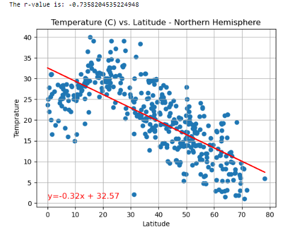

# python-api-challenge
Using Python requests, APIs, and JSON traversals to answer a fundamental question: "What is the weather like as we approach the equator?
## Background
 Data's true power is its ability to definitively answer questions. So, let's leverage the knowledge and techniques I have acquired in Python requests, APIs, and JSON traversals to provide concrete evidence for a fundamental question: "What is the weather like as we approach the equator?"
 While it may seem obvious that the weather gets hotter near the equator, we can support this assertion by gathering and analyzing data from reliable sources.
 By analyzing reliable weather data from APIs at various latitudes, we can statistically demonstrate the correlation between latitude and weather patterns, providing compelling evidence that supports the claim of increasing temperatures near the equator.
 
 ### Before starting the challenge:
- Create a new repository on GitHub specifically for this project, naming it "python-api-challenge".
- Clone the newly created repository to your local machine using Git.
- Inside the local repository, create a directory called **"WeatherPy"** (or any desired name) to organize your project files.
- Place the files **"api_keys.py"**, **"WeatherPy.ipynb"**, and **"VacationPy.ipynb"** (provided in the starter code ZIP file) into the **"WeatherPy"** directory.
- Make sure to add a ".gitignore" file to your repository before pushing any changes to GitHub.

#### Add a .gitignore File
For this challenge, I will need to add a .gitignore file to my repo. Doing so will prevent the api_keys.py file that contains my API key from being shared with the public. If I skip this step, anyone using GitHub could copy and use my API key, and I may incur charges as a result.

To get started, I will type git status in the command line to see a list of all the untracked files that I have created so far.

To add only the WeatherPy.ipynb file to GitHub, for example, type git add WeatherPy.ipynb.I will keep in mind that I would have to add each file individually when adding or updating a file. A more efficient solution is to add all of the files that I don't want to track to the .gitignore file.

Before adding my files to GitHub, add api_keys.py to the .gitignore file by following these steps:
  1: Open my python-api-challenge GitHub folder in VS Code.
  
  2:Open the .gitignore file and type the following code on the first line:

**Adding config.py file.**

  api_keys.py

  3: In the command line, type git status and press Enter. The output should indicate that the .gitignore file has been modified and the api_keys.py file is untracked.

  4: Use git add, git commit, and git push to commit the modifications to the .gitignore, WeatherPy.ipynb and VacationPy.ipynb files to GitHub.

On GitHub, the only new python files I should find are **WeatherPy.ipynb** and **VacationPy.ipynb.**

### Instructions
This activity is broken down into two deliverables, WeatherPy and VacationPy.

#### Part 1: WeatherPy
In this deliverable, I'll create a Python script to visualize the weather of over 500 cities of varying distances from the equator. I'll use the citipy Python libraryLinks to an external site., the OpenWeatherMap APILinks to an external site., and my problem-solving skills to create a representative model of weather across cities.

For this part, I'll use the **WeatherPy.ipynb** Jupyter notebook provided in the starter code ZIP file. The starter code will guide me through the process of using my Python coding skills to develop a solution to address the required functionalities.

To get started, the code required to generate random geographic coordinates and the nearest city to each latitude and longitude combination is provided.

**Requirement 1: Create Plots to Showcase the Relationship Between Weather Variables and Latitude**
To fulfill the first requirement, I'll use the OpenWeatherMap API to retrieve weather data from the cities list generated in the starter code. Next, I'll create a series of scatter plots to showcase the following relationships:
- Latitude vs. Temperature
- Latitude vs. Humidity
- Latitude vs. Cloudiness
- Latitude vs. Wind Speed

**Requirement 2: Compute Linear Regression for Each Relationship**
To fulfill the second requirement, I"ll compute the linear regression for each relationship. Then I'll separate the plots into Northern Hemisphere (greater than or equal to 0 degrees latitude) and Southern Hemisphere (less than 0 degrees latitude). I may find it helpful to define a function in order to create the linear regression plots.

Next, I"ll create a series of scatter plots. I"ll make sure to include the linear regression line, the model's formula, and the r values as you can see in the following image:

I'll create the following plots:
- Northern Hemisphere: Temperature vs. Latitude
- Southern Hemisphere: Temperature vs. Latitude
- Northern Hemisphere: Humidity vs. Latitude
- Southern Hemisphere: Humidity vs. Latitude
- Northern Hemisphere: Cloudiness vs. Latitude
- Southern Hemisphere: Cloudiness vs. Latitude
- Northern Hemisphere: Wind Speed vs. Latitude
- Southern Hemisphere: Wind Speed vs. Latitude
- After each pair of plots, explain what the linear regression is modeling. Describe any relationships that I notice and any other findings I may uncover.

#### Part 2: VacationPy
In this deliverable, I'll use my weather data skills to plan future vacations. Also, I'll use Jupyter notebooks, the geoViews Python library, and the Geoapify API.

The code needed to import the required libraries and load the CSV file with the weather and coordinates data for each city created in Part 1 is provided to help me get started.

My main tasks will be to use the Geoapify API and the geoViews Python library and employ my Python skills to create map visualizations.

To succeed on this deliverable of the assignment, I'll open the **VacationPy.ipynb** starter code and complete the following steps:

  1: I'll create a map that displays a point for every city in the **city_data_df** DataFrame as shown in the following image. The size of the point should be the humidity in each city.
  

  
  2: Then I'll narrow down the **city_data_df** DataFrame to find my ideal weather condition. For example:
   - A max temperature lower than 27 degrees but higher than 21
   - Wind speed less than 4.5 m/s
   - Zero cloudiness  

**Note:** Feel free to adjust my specifications, but make sure to set a reasonable limit to the number of rows returned by my API requests.

 3: I'll create a new DataFrame called **hotel_df** to store the city, country, coordinates, and humidity.

 4: For each city, use the Geoapify API to find the first hotel located within 10,000 meters of my coordinates.

 5: Then I'll add the hotel name and the country as additional information in the hover message for each city on the map as in the following image:
 

While building my script, I'll have to pay attention to the cities I am using in my query pool. Am I covering the full range of latitudes and longitudes? Or, am I choosing 500 cities from one region of the world? Even if I were a geography genius, simply listing 500 cities based on my personal selection would create a biased dataset. I'll have to try to think of ways that I can counter these selection issues.
**Hint:** I'll consider the full range of latitudes.

**References**

Data for this dataset was generated by edX Boot Camps LLC.

